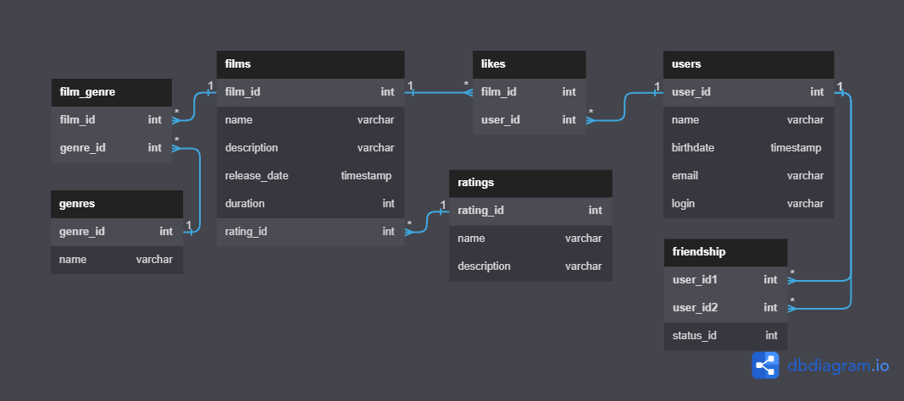

# java-filmorate


Схема состоит из 5 таблиц:
- film
- user
- genre
- rating
- like
  Связи между таблицами обозначены линиями:
- 1-1 связь one to one
- *-1 связь many to one

Примеры основных запросов для Film:

1) метод getAll():
   ``` sql
   SELECT *
   FROM film;
   ``` 
2) метод getById(int id):
   ``` sql
   SELECT *
   FROM film
   WHERE film_id=id;
   ``` 
3) метод getTopFilmCount(int count):
   ``` sql
   SELECT COUNT(DISTINCT(user_id)) AS top
   FROM like
   GROUP BY film_id
   ORDER BY top DESC
   LIMIT count;

Примеры основных запросов для User:

1) метод getAll():
   ``` sql
   SELECT *
   FROM user;
   ``` 

2) метод getById(int id):
   ``` sql
   SELECT *
   FROM user
   WHERE user_id=id;
   ``` 
3) метод getUserFriends(int id):

``` sql
   SELECT friends_to
   FROM user
   WHERE user_id=id;
   ``` 

4) метод getCommonFriends(int id, int otherId):

``` sql
   SELECT u2.friends_to
   FROM user AS u2
   WHERE user_id=id
   JOIN (SELECT friends_to
   FROM user
   WHERE user_id=otherId) AS u1 ON u1.friends_to=u2.friends_to;
   ```
   